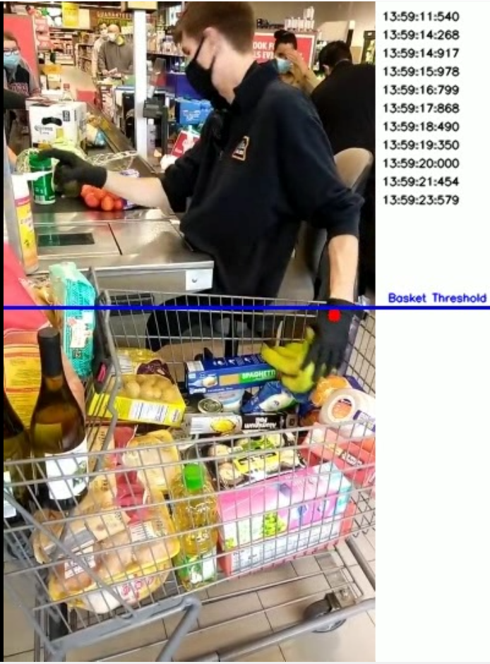

# Cashier Wrist Tracker
##  For detecting unscanned items

Video analysis tool designed to detect and track cashier actions in retail environments. Specifically, it monitors the **cashier's left wrist** and generates an event whenever an item is placed into a basket. This is triggered when the left wrist moves into a predefined "basket area" in the video.
Watch the video (39sec): https://youtube.com/shorts/uhsP46S5K4k

## Features

- **Video Analysis:** Process video footage of cashiers at checkout counters.
- **Left-Wrist Tracking:** Monitors the movement of the cashier's left wrist.
- **Basket-Area Detection:** Detects when the left wrist enters a predefined basket region.
- **Event Generation:** Logs an event each time an item is placed into the basket.
- **Pose Estimation:** Uses pose detection to track wrist and hand movements.

Technical details:
- Neural network - YOLOv8n-pose (pre-trained)
- Frame sampling - 0.2 sec
